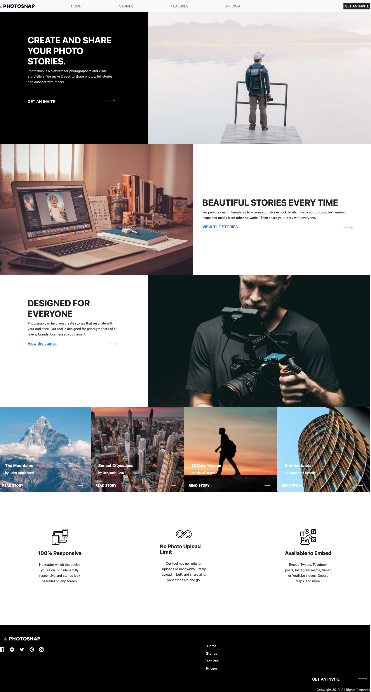

# Frontend Mentor - Photosnap Website solution

This is a solution to the [Photosnap Website challenge on Frontend Mentor](https://www.frontendmentor.io/challenges/photosnap-multipage-website-nMDSrNmNW). Frontend Mentor challenges help you improve your coding skills by building realistic projects. 

## Table of contents

- [Overview](#overview)
  - [The challenge](#the-challenge)
  - [Screenshot](#screenshot)
  - [Links](#links)
- [My process](#my-process)
  - [Built with](#built-with)
  - [What I learned](#what-i-learned)
  - [Continued development](#continued-development)
- [Author](#author)

## Overview

### The challenge

Users should be able to:

- View the optimal layout for each page depending on their device's screen size
- See hover states for all interactive elements throughout the site

### Screenshot



### Links

- Solution URL: https://www.frontendmentor.io/solutions/photosnap-reactbootstrap-Jcve3Ah2gz
- Live Site URL: https://photosnap-delta.vercel.app/

## My process

### Built with

- Bootstrap
- Vanilla JS
- [React](https://reactjs.org/) - JS library

### What I learned

One thing I have learned is how to use a loop in vanilla JS to add content to the DOM. Initially, I intended to use React to code the Stories page, but I faced difficulties in exporting the component to both the homepage and Stories page. As a result, the homepage image section uses React, while the Stories image section employs the vanilla JS code below.

```imageData.forEach(imageData => {
  const imageWrapper = document.createElement('div');
  imageWrapper.classList.add('image-wrapper');
  imageWrapper.style.backgroundImage = `url(${imageData.backgroundImageSrc})`;

  const imageInfo = document.createElement('div');
  imageInfo.classList.add('image-info');

  const imageDate = document.createElement('div');
  imageDate.classList.add('image-date');
  imageDate.textContent = imageData.date;

  const imageTitle = document.createElement('h3');
  imageTitle.classList.add('image-title');
  imageTitle.textContent = imageData.title;

  const imageArtist = document.createElement('p');
  imageArtist.classList.add('image-artist');
  imageArtist.textContent = `by ${imageData.artist}`;

  const hr = document.createElement('hr');

  const imageBody = document.createElement('div');
  imageBody.classList.add('image-body');

  const readStory = document.createElement('p');
  readStory.classList.add('image-story');
  readStory.textContent = 'READ STORY';

  const imageArrow = document.createElement('img');
  imageArrow.classList.add('image-arrow');
  imageArrow.src = '../assets/shared/desktop/arrow.svg';
  imageArrow.alt = 'arrow';
  imageArrow.setAttribute('preserveAspectRatio', 'none');
```

### Continued development

My goal is to further develop my skills in JavaScript to create a strong foundation for expanding into TypeScript. By working with JavaScript on a regular basis, I hope to strengthen my understanding of essential concepts and apply them in practical applications. My plan is to also explore JavaScript frameworks such as React, Angular, and Vue.js to develop more complex web applications. Additionally, I am interested in learning server-side JavaScript frameworks such as Node.js and Express.js to create scalable and efficient server-side applications. With continued learning and practice, I am confident in my ability to grow as a web developer and take on more challenging projects.
## Author

- Website - [Keith Gaines](https://keithgaines.github.io)
- Frontend Mentor - [@keithgaines](https://www.frontendmentor.io/profile/keithgaines)

